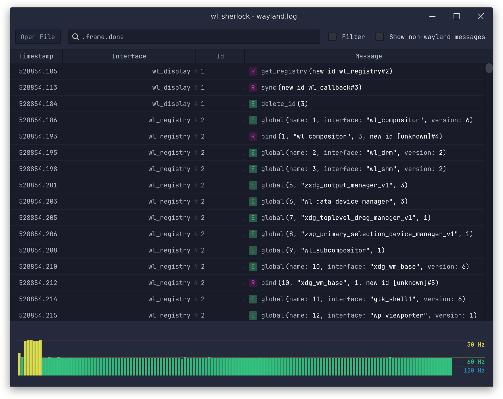

**wl_sherlock** is a simple tool to parse, filter and understand wayland protocol logs.

<picture>
  <source srcset="screenshot.png 2x" />
  
</picture>

## Filter messages

Using the text field on top you can filter messages based on the interface or the id
of the object that's being talked about or based on the request being send or the event
being received. So for example

```
xdg_toplevel
```

would select all messages for the `xdg_toplevel` interface. Selecting messages based on the
object id is done by prefixing a number with `@` or `#`.

```
@31
```

Filtering requests or events is done by using a `.` in front of a name.

```
.configure
```

Of course these can all be combined. The following filter

```
wl_surface@20.commit
```

will select all `.commit()` messages for the object with id 20 of the
`wl_surface` interface.

## Graph view

The graph view at the bottom of the window will always show the delta time
between all filtered messages. If the filter is empty it shows the time
difference between all messages. So if combined with a filter on the
`.commit` request it can be used to measure the framerate at which the
application is rendering.
